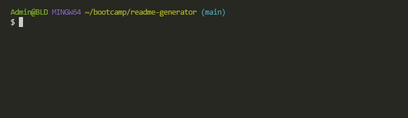

# README Generator
[](https://opensource.org/licenses/BSD-3-Clause)
## Description
Command-line tool to generate a custom README file.
## Table of Contents
  - [Description](#description)
  - [Table of Contents](#table-of-contents)
  - [Installation](#installation)
  - [Usage](#usage)
  - [License](#license)
  - [Questions](#questions)
## Installation
Get the code by cloning [the repository](https://github.com/LemonPocky/readme-generator).

Navigate to the folder the code is in and run ```npm install```.
## Usage


Run the generator with ```node index.js```.

Follow the prompts to fill in your README file. Your README will be generated as "myREADME.md".
## License
Redistribution and use in source and binary forms, with or without modification, are permitted provided that the following conditions are met:

1. Redistributions of source code must retain the above copyright notice, this list of conditions and the following disclaimer.

2. Redistributions in binary form must reproduce the above copyright notice, this list of conditions and the following disclaimer in the documentation and/or other materials provided with the distribution.

3. Neither the name of the copyright holder nor the names of its contributors may be used to endorse or promote products derived from this software without specific prior written permission.
## Questions
Questions?

Contact me on GitHub: [LemonPocky](https://github.com/LemonPocky)
